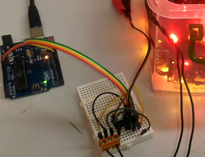

# Christmas Light Controller

Have you lost or broken the controller for your christmas lights this season? Can't find a suitable power supply among our wide range of DC power supplies? Do you want to jazz up your christmas lights with your own effects and control?

This project uses a few handy components on a traditional UNO prototyping board; Build the module as below then place on top of the UNO.

With the open-source nature of this project you would be able to attach sensors to it if you required.
This project uses a few handy components on a traditional UNO prototyping board to make setting up a breeze. Simply build the module then place on top of the UNO, you can even set up your own sensors or use the XC4411 Uno with WiFi to make it IoT controlled.

Provides adjustable voltage, between 12 and 40 volts, with two programmable outputs, suitable for most lights. Power by any DC power you have spare, 5-12v.

Requires solid-core wires (WH3032) terminal headers (HM3172) if you prefer (not supplied).

- [Christmas Light Controller](#Christmas-Light-Controller)
  - [Bill of Materials](#Bill-of-Materials)
    - [You might also want](#You-might-also-want)
    - [Alternatives and additions](#Alternatives-and-additions)
  - [Software](#Software)
  - [System layout](#System-layout)
    - [Module 1: Boost Converter](#Module-1-Boost-Converter)
    - [Module 2: Motor Controller](#Module-2-Motor-Controller)
  - [Assembly](#Assembly)
  - [Programming and source code](#Programming-and-source-code)
  - [Use](#Use)
  - [Future Improvements](#Future-Improvements)
  - [Further reading](#Further-reading)

## Bill of Materials

| Qty | Code                                     | Description                |
| --- | ---------------------------------------- | -------------------------- |
| 1   | [XC4410](https://jaycar.com.au/p/XC4410) | Arduino UNO                |
| 1   | [ZK8880](https://jaycar.com.au/p/ZK8880) | Motor Driver IC            |
| 1   | [PI6502](https://jaycar.com.au/p/PI6502) | IC socket                  |
| 1   | [ZV1656](https://jaycar.com.au/p/ZV1656) | Boost regulator            |
| 1   | [LF1276](https://jaycar.com.au/p/LF1276) | Ferrite Choke 220uH        |
| 1   | [ZR1020](https://jaycar.com.au/p/ZR1020) | Schottky Diode             |
| 1   | [XC4482](https://jaycar.com.au/p/XC4482) | Prototyping Shield         |
| 1   | [RE6310](https://jaycar.com.au/p/RE6310) | 100uF 16v electrolytic cap |
| 1   | [RE6336](https://jaycar.com.au/p/RE6336) | 220uF 35v electrolytic cap |
| 1   | [RZ6624](https://jaycar.com.au/p/RZ6624) | 330nF 35v tantalum cap     |
| 1   | [RT4652](https://jaycar.com.au/p/RT4652) | 20k Trimpot                |
| 1   | [RR0580](https://jaycar.com.au/p/RR0580) | 2k2 resistors              |

### You might also want

- Bootlace crimps: [PT4533](https://jaycar.com.au/p/PT4533)
- Terminal headers: [HM3172](https://jaycar.com.au/p/HM3172), etc.
- Solid-core wires: [WH3032](https://jaycar.com.au/p/WH3032)
- Some 12v plugpack: [MP3490](https://jaycar.com.au/p/MP3490) is a good choice if you don't have one

### Alternatives and additions

- If you want an easier setup, you can use [XC4609](https://jaycar.com.au/p/XC4609) Boost module to replace the components and keep this as modular and versatile, but at the expense of a significant price increase.
  - This would remove: [ZV1656](https://jaycar.com.au/p/ZV1656), [LF1276](https://jaycar.com.au/p/LF1276), [ZR1020](https://jaycar.com.au/p/ZR1020), [RE6310](https://jaycar.com.au/p/RE6310), [RE6336](https://jaycar.com.au/p/RE6336), [RZ6624](https://jaycar.com.au/p/RZ6624), [RT4652](https://jaycar.com.au/p/RT4652) and [RR0580](https://jaycar.com.au/p/RR0580) and simplify the build.
  - Simply connect the boosted voltage into the `VIN` pin of [ZK8880](https://jaycar.com.au/p/ZK8880)
- You can also add [XC4514](https://jaycar.com.au/p/XC4514) to the project to allow for an input voltage between 12V to 35V DC; this would be set at 5V to plug into the Arduino.

## Software

This project is entirely done in the Arduino IDE with no libraries needed.

## System layout

This is a super simple setup to understand and works well in a picture:

You might first be asking yourself:

_"Why are we using a motor controller if we are handling christmas lights?"_

The motor controller IC ([ZK8880](https://jaycar.com.au/p/ZK8880)) is only called such due to what it is most often used for, however it performs exactly what we require in this project, which is to take a higher voltage (such as 31V) and be able to control it logically through the arduino, which is only a 5V system.

We use two outputs of the motor driver to power our lights. Some lights are set up differently, but we've found two main ways of how lights are wired up. You'll be able to tell by whether the christmas lights you have are 2-wire or 3 wire. Most often is two, but the 3rd wire if present would just be a ground connection.

Below is a bit more of the in-depth development and testing of the two modules, but if you just want to build the project you can skip to [Assembly](#assembly)

### Module 1: Boost Converter

### Module 2: Motor Controller

## Assembly

## Programming and source code

## Use

## Future Improvements

## Further reading
