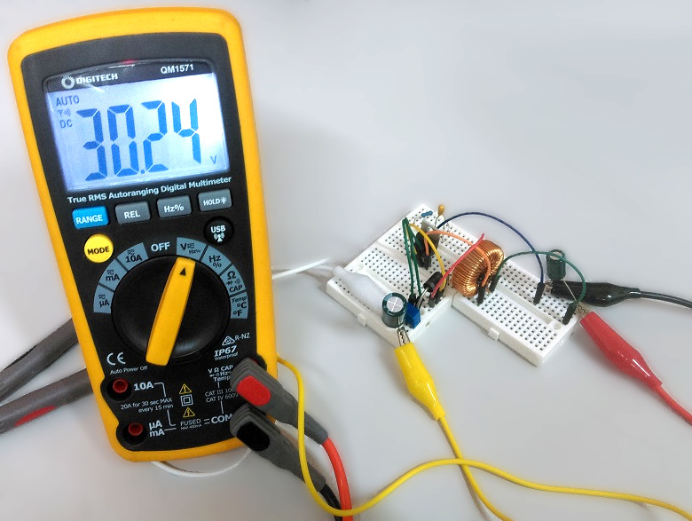

# Christmas Light Controller

Have you lost or broken the controller for your christmas lights this season? Can't find a suitable power supply among our wide range of DC power supplies? Do you want to jazz up your christmas lights with your own effects and control?


This project uses a few handy components on a traditional UNO prototyping board; Build the module as below then place on top of the UNO.

With the open-source nature of this project you would be able to attach sensors to it if you required.
This project uses a few handy components on a traditional UNO prototyping board to make setting up a breeze. Simply build the module then place on top of the UNO, you can even set up your own sensors or use the XC4411 Uno with WiFi to make it IoT controlled.

Provides adjustable voltage, between 12 and 40 volts, with two programmable outputs, suitable for most lights. Power by any DC power you have spare, 5-12v.

Requires solid-core wires ([WH3032](https://jaycar.com.au/p/WH3032)) terminal headers ([HM3172](https://jaycar.com.au/p/HM3172)) if you prefer (not supplied).

## Table of Contents

- [Christmas Light Controller](#Christmas-Light-Controller)
  - [Table of Contents](#Table-of-Contents)
  - [Bill of Materials](#Bill-of-Materials)
    - [You might also want](#You-might-also-want)
    - [Alternatives and additions](#Alternatives-and-additions)
  - [Software](#Software)
  - [System layout](#System-layout)
    - [Light connections](#Light-connections)
    - [Module 1: Motor Controller](#Module-1-Motor-Controller)
    - [Module 2: Boost Converter](#Module-2-Boost-Converter)
      - [Over-voltage and circuit faults](#Over-voltage-and-circuit-faults)
  - [Assembly](#Assembly)
  - [Programming and source code](#Programming-and-source-code)
  - [Use](#Use)
  - [Future Improvements](#Future-Improvements)
  - [Further reading](#Further-reading)

## Bill of Materials

| Qty | Code                                     | Description                |
| --- | ---------------------------------------- | -------------------------- |
| 1   | [XC4410](https://jaycar.com.au/p/XC4410) | Arduino UNO                |
| 1   | [ZK8880](https://jaycar.com.au/p/ZK8880) | Motor Driver IC            |
| 1   | [PI6502](https://jaycar.com.au/p/PI6502) | IC socket                  |
| 1   | [ZV1656](https://jaycar.com.au/p/ZV1656) | Boost regulator            |
| 1   | [LF1276](https://jaycar.com.au/p/LF1276) | Ferrite Choke 220uH        |
| 1   | [ZR1020](https://jaycar.com.au/p/ZR1020) | Schottky Diode             |
| 1   | [XC4482](https://jaycar.com.au/p/XC4482) | Prototyping Shield         |
| 1   | [RE6310](https://jaycar.com.au/p/RE6310) | 100uF 16v electrolytic cap |
| 1   | [RE6336](https://jaycar.com.au/p/RE6336) | 220uF 35v electrolytic cap |
| 1   | [RZ6624](https://jaycar.com.au/p/RZ6624) | 330nF 35v tantalum cap     |
| 1   | [RT4652](https://jaycar.com.au/p/RT4652) | 20k Trimpot                |
| 1   | [RR0580](https://jaycar.com.au/p/RR0580) | 2k2 resistors              |

### You might also want

- Bootlace crimps: [PT4533](https://jaycar.com.au/p/PT4533)
- Terminal headers: [HM3172](https://jaycar.com.au/p/HM3172), etc.
- Solid-core wires: [WH3032](https://jaycar.com.au/p/WH3032)
- Some 12v plugpack: [MP3490](https://jaycar.com.au/p/MP3490) is a good choice if you don't have one

### Alternatives and additions

- If you want an easier setup, you can use [XC4609](https://jaycar.com.au/p/XC4609) Boost module to replace the components and keep this as modular and versatile, but at the expense of a significant price increase.
  - This would remove: [ZV1656](https://jaycar.com.au/p/ZV1656), [LF1276](https://jaycar.com.au/p/LF1276), [ZR1020](https://jaycar.com.au/p/ZR1020), [RE6310](https://jaycar.com.au/p/RE6310), [RE6336](https://jaycar.com.au/p/RE6336), [RZ6624](https://jaycar.com.au/p/RZ6624), [RT4652](https://jaycar.com.au/p/RT4652) and [RR0580](https://jaycar.com.au/p/RR0580) and simplify the build.
  - Simply connect the boosted voltage into the `VIN` pin of [ZK8880](https://jaycar.com.au/p/ZK8880)
- You can also add [XC4514](https://jaycar.com.au/p/XC4514) to the project to allow for an input voltage between 12V to 35V DC; this would be set at 5V to plug into the Arduino.

## Software

This project is entirely done in the Arduino IDE with no libraries needed. The majority of the project is building the boost converter.

## System layout

This is a super simple setup to understand and works well in a picture:


You might first be asking yourself:

_"Why are we using a motor controller if we are handling christmas lights?"_

The motor controller IC ([ZK8880](https://jaycar.com.au/p/ZK8880)) is only called such due to what it is most often used for, however it performs exactly what we require in this project, which is to take a higher voltage (such as 31V) and be able to control it logically through the arduino, which is only a 5V system.

### Light connections

We use two outputs of the motor driver to power our lights. Some lights are set up differently, but we've found two main ways of how lights are wired up. You'll be able to tell by whether the christmas lights you have are 2-wire or 3 wire. Most often is two, but the 3rd wire if present would just be a ground connection, similar to the below pictures.


Below is a bit more of the in-depth development and testing of the two modules, but if you just want to build the project you can skip to [Assembly](#assembly)

### Module 1: Motor Controller

The motor controller is a very simple set up, with the important bits of the datasheet shown below:


The logic here is that we are going to control the `IN1` and `IN2` pins with the arduino, while feeding it **31v** into the `Vs` pin so that the output goes high/low at the **31v** level.

You can see this in action with our breadboard setup and our lab power supply (We use [MP3842](https://jaycar.com.au/p/MP3842), super handy and very recommended for your own lab!).


You can see that the idea works well, so let's go on to building the boost converter circuit.

### Module 2: Boost Converter

The boost converter is what is used to bump up the circuit from whatever voltage input up to 31V. There's some caveats with the project setup in general but if you've got alternative needs feel free to modify the project to suit.

- We limit the input voltage to **12v**. This is less to do with the chips and more to do with the arduino UNO itself only allowing a max voltage of 12v. If you separate the regulator you can use any other voltage (within reason, check the [ZV1656](https://jaycar.com.au/p/ZV1656) datasheet.)

We can first build the circuit on a breadboard to make sure it works, this is powered off our power supply running at 12v.



This is pretty similar to what we have on the datasheet, substituted with out part numbers:


There's some value differences but there's not much to mention in that regard, as we simply selected what we had on hand. The feed-back will tell the regulator how much voltage it is outputting and it will adjust accordingly.

#### Over-voltage and circuit faults

One **important** note to mention is that the [ZR1020](https://jaycar.com.au/p/ZR1020) has a limit of 40v, but our regulator can go higher than that, which will cause the diode to break if we try to set the regulator to be higher. You can fix this by simply putting two diodes in series next to each other.


If you do not put two diodes in series, you must make sure that the trimpot is set to be mid-way when you put it into the circuit, so that it does not flick up to higher than 40v and overshot the diode. You can also put in another resistor to protect the circuit, which for a 40v maximum comes at around 650 ohms using the calculations below (taken from the datasheet.)


For a 40v output ( our maximum without a second diode ) the ratio of `R1/R2` comes to be 31.52, if we are using a 20k trimpot as `R1`, `R2` must be LARGER than `635 ohms`.

Just for reference, if you wanted the voltage to be set to `31v` and non-adjustable, you can replace the trimpot with any values that form a ratio: `R1/R2 = 31.52`, but we found it easier to use a trimpot to get it spot on.

We did not include the `R2` or second diode in the parts list, and kept it with the trimpot, use caution that you do break the schottky diode.

## Assembly

We laid out the shield as below, making sure everything fits together:


You'll find in our build we use screw terminals so we can attach and de-attach wires whenever we want, If you don't have any screw terminals, you can simply connect the wires straight into where the terminals are.

It's good to start out with putting the 100uF cap, 2-wire terminal (if present, we used [HM3172](https://jaycar.com.au/p/HM3172)) and IC socket on to the board as shown. Notice with the IC socket, the notch is facing downwards, outside of the board; This is to signify the position of the motor controller IC.


You can use the legs of the cap to connect to the terminal, or where the power input might be. This cap is polarised, so you must make sure that the positive and negative line up correctly. In our build, we put negative facing downwards, towards the analog pins.


This leaves just enough room for the coil to go next to it, the coil legs are very thick which only just fit the pcb holes in the prototyping shield.


We then bend the two legs of the coil to be perpendicular to each other so that the coil is very supported and can't easily bend out. Because the coil is so bulky and heavy, it's an easy point of failure if something was to knock the board or damage it.


Next up we can put in the trimpot and output cap (220uF) - here you can start to see what we're doing, as the output cap is also polarised and will have the negative strip on the bottom of the board.


This lines up with the input cap's negative pin, however the positive bends up to be positioned with the `Vs` of the IC socket.


The trimpot itself also bridges across the output cap, with the middle lead coming out the opposite direction, this will connect to the feedback of the regulator later.

Next we can put in the diode/resistor/little-cap, as they match on the following image.


Notice the polarity of the diode, and how it connects to the `Vs` pin on the IC socket as well as the cap.

Now we can start to see the layout of where the regulator fits in. The `comp` pin (pin1) Connects to the resistor->cap->ground. We also have the base of the diode to fit in pin4 (`switch`) of the regulator, and the coil fits between pins 4 and 5 (`vin` and `switch`). pin3 is grounded, and pin 2 fits to the trimpot (`feedback`).


Put in the regulator facing the coil as shown in the below picture.


Then bend and solder the pins so that they make the connections as shown


By now it should be clear how pin1 connects to the resistor and goes to ground, 2 is bent out, and almost reaches the same row as the trimpot centre pin. pin 4 connects to the diode, and the diode connects to the output cap from before.

Pin 5 is bent out a little bit to give it a little bit of room, and pin 3 is not yet soldered.

now all the components are placed, we finish of the soldering on the underside of the prototyping board:


1. A wire from trimpot to pin 2 of regulator
2. Ground line connection
3. Ground connection from pin 3 of regulator
4. Vin to Arduino Vin, as well as to coil and pin 5 of regulator
5. Other side of coil to pin 4 of regulator
6. 5V to `enable` and `Vss` of chip connection.


There is also two blue wires we used to jump pins 10 and 11 down to input 3 and 4 of the Motor IC, signified by the two green upward arrows. The output of this (which is the 31v output) is signified by the orange downwards arrows, which we soldered to each side of the 3-way header terminal ([HM3173](https://jaycar.com.au/p/HM3173)) with the ground connection connected in the middle.

Check all soldered connections, make sure all the grounds are connected and where each lead should go. In the `images` folder of the project files, there's a few more images that might be able to help you sort out any issues.

## Programming and source code

Programming is very easy with this, as you can simply make any pattern that you want using very simple `digitalWrite()` and `delay()`:

```cpp

void setup(){

  pinMode(11, OUTPUT);
  pinMode(10, OUTPUT);
}

void loop(){
  //show colour 1;
  digitalWrite(11, HIGH);
  digitalWrite(10, LOW);

  delay(500); //wait half a second

  //show colour 2:
  digitalWrite(10, HIGH);
  digitalWrite(11, LOW);

  delay(500); //wait half a second

  //any more pattern or changes here...
}
```

As the connections are a little different in 2-wire or 3-wire setups (as explained in [Light Connections](#Light-connections)), you could experience some strange behaviour if the light patterns aren't showing as you'd expect.

| Pin 10 | Pin 11 | Output (2-wire) | Output (3-wire)    |
| ------ | ------ | --------------- | ------------------ |
| LOW    | LOW    | OFF             | OFF                |
| HIGH   | LOW    | Colour 1        | Colour 1           |
| LOW    | HIGH   | Colour 2        | Colour 2           |
| HIGH   | HIGH   | **OFF**         | **Colour 1 and 2** |

If you have a 2-wire setup, but you want to have both colours showing, you can simply show Colour 1 and Colour 2 in quick succession, The human eye has a very slow "refresh rate" and so any less than 45 milliseconds between light-changes would just be picked up as both lights showing at the same time: try this in code:

```cpp
void loop(){

  digitalWrite(10, HIGH);
  digitalWrite(11, LOW);
  delay(20);
  digitalWrite(11, HIGH);
  digitalWrite(10, LOW);
  delay(20);
}
```

Because both pins 10 and 11 are `PWM` pins, you can also use `analogueWrite` on the pin to produce a fading effect.

## Use

Adjust the voltage to be the correct voltage you need, if you still have the box for your lights it should say what voltage the lights run at. One of the more common voltages that we've found is 31v but they could also be 24v or 35v, so it's worth while to check.

If you can't find it, you can run simple code to have it always output HIGH on one of the pins, then connect the lights and slowly turn up the voltage with the trimpot; If the lights never turn on ( but you can use a multimeter to see a voltage being applied) then the lights must be busted.

If you do not see a voltage coming from the end of the diode, turn off the circuit and check the diode with the multimeter, it might have been killed as mentioned in [Circuit Faults](#Over-voltage-and-circuit-faults).

If everything is working correctly, connect the lights to the motor controller and give it 12v input, once the arduino is programmed with a pattern it will just do so indefinitely.

## Future Improvements

The complexity of this project lies on building the prototyping shield, but once that has finished you can simply connect that on any arduino-shield compatible device, and still use many of the pins available on the arduino;

If you want to use `SPI` on the arduino it would be a good idea to change `pin11` to be `pin9` or similar, as pin 11 is the `MOSI` connection for SPI devices.

Some suggestions:

- A light sensor ([XC4446](https://jaycar.com.au/p/XC4446) or similar) to turn both pins LOW during daylight hours.
- An audio sensor ([XC4438](https://jaycar.com.au/p/XC4438)) along with an `FHT` library to provide beat detection and dance the lights to the music (check our music beat bar project for inspiration!).

You could also use our new [Uno with WiFi](https://jaycar.com.au/p/XC4411) which includes an ESP866 to host a web-app, which can then communicate with the arduino using `Serial.read` and `Serial.write` commands.

## Further reading

Not much here for this project, happy hacking and Merry Christmas :smile:
